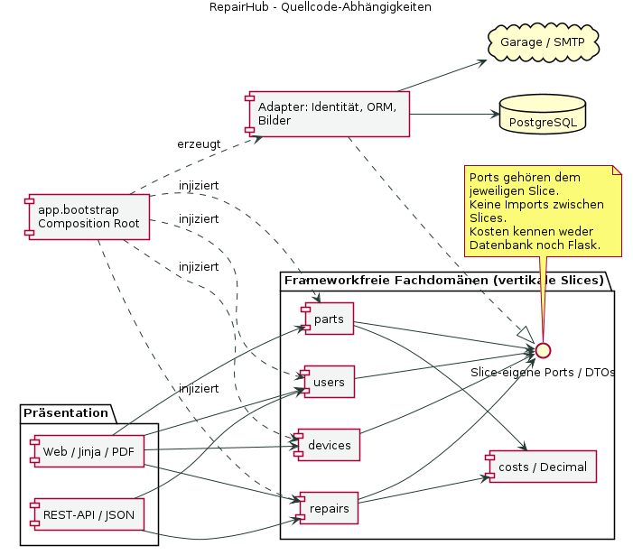
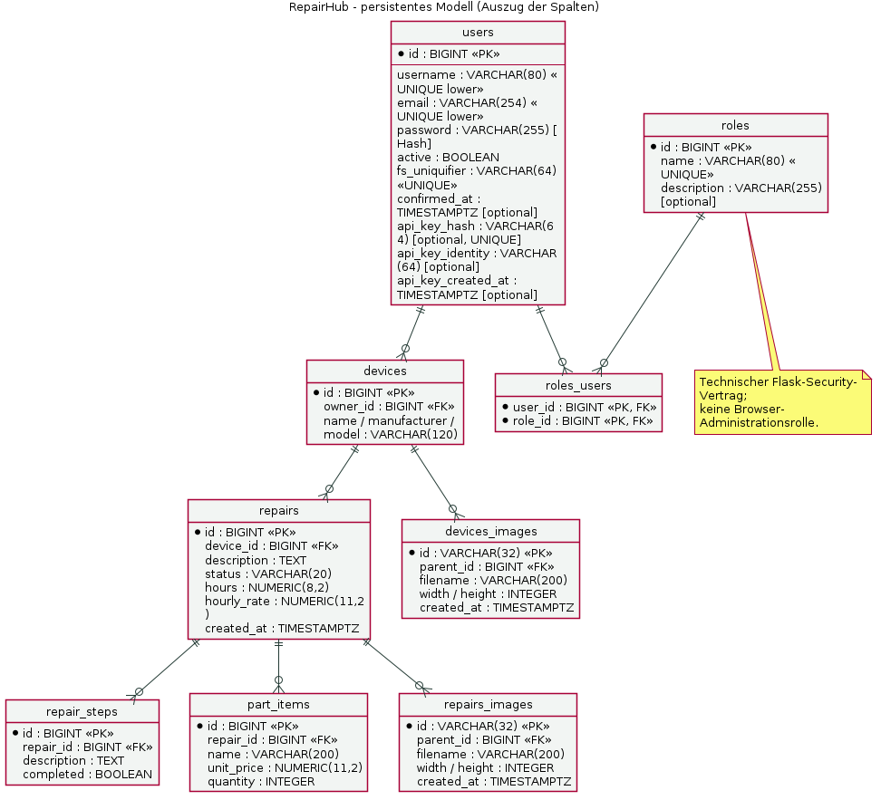
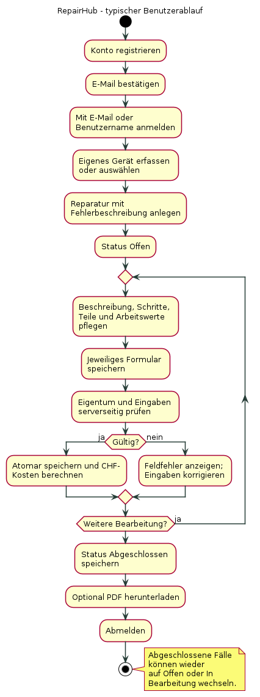
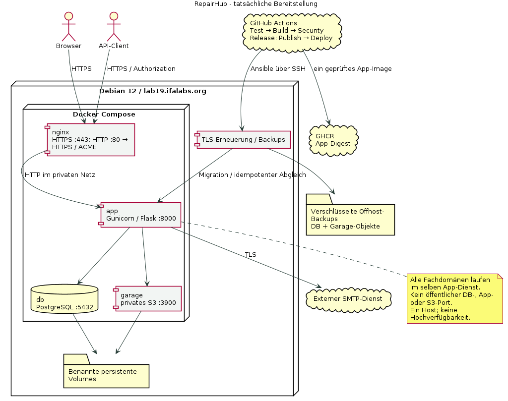
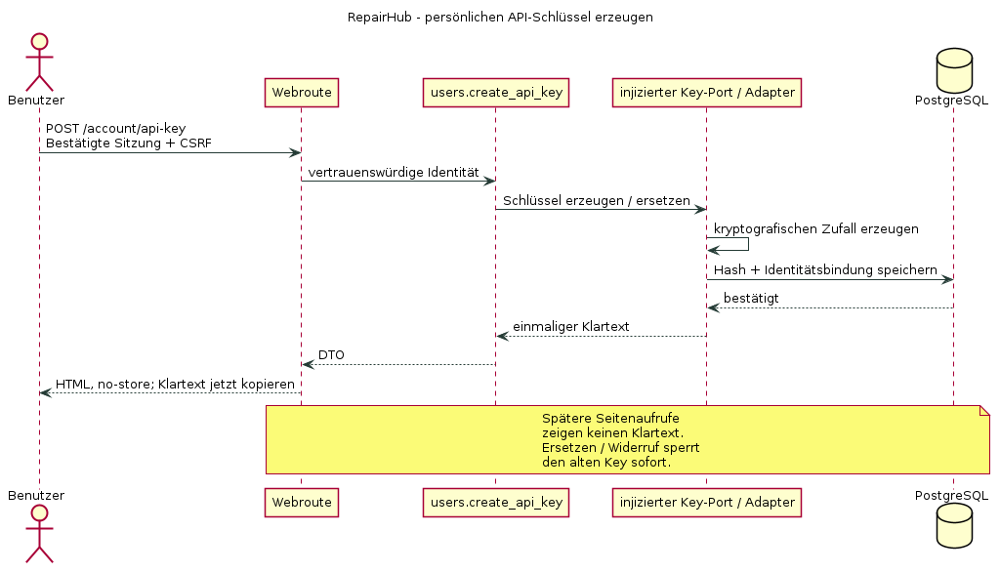
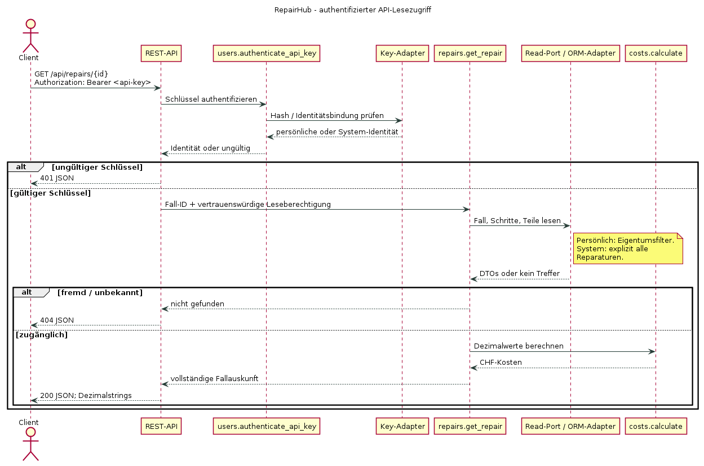

# Architekturstand der Umsetzung

Diese Diagramme bilden den geprüften Stand vom 22. September 2026 ab. Sie ersetzen
für die Abgabe die älteren Entwurfszeichnungen unter `Diagramme/Kapitel4`.
Quellen sind die eigenen Domain-Ports, Adapter, ORM-Modelle, Routen und Compose-Dateien;
die Darstellung wurde mit Codex anhand dieser Dateien abgeglichen.

## Fachdomänen und Abhängigkeitsumkehr

Die Pfeile zeigen Quellcode-Abhängigkeiten. Ports gehören ihren jeweiligen Slices;
die gemeinsame Box dient nur der Übersicht, sie ist kein zentrales Port-Paket.
Adapter implementieren diese Verträge, und `app.bootstrap` injiziert sie.
Die Darstellung verändert die [verbindliche Architektur](../domain-architecture.md) nicht.

## Persistentes Datenmodell

Die fachlichen Anwendungsfälle bestimmen das Schema. Neben den fünf ursprünglichen
Entitäten existieren getrennte Bildmetadaten und technische Bibliothekstabellen.
Bilder selbst liegen privat in Garage. API-Schlüssel werden nur gehasht gespeichert.
`roles` und `roles_users` begründen keine Administrationsoberfläche. Die Spaltenauswahl
ist beschriftet; verbindlich für Constraints und Defaults bleiben die Migrationen.

## Benutzerablauf

Jedes Formular wird separat gespeichert. Status und Schritterledigung sind getrennt;
eine Wiederaufnahme abgeschlossener Fälle ist erlaubt.

## Bereitstellung

Vier Produktionsdienste laufen auf einem Debian-12-Host. Nur Nginx ist öffentlich
erreichbar. Mailpit gehört ausschliesslich zur Entwicklung. Infrastrukturimages
sind gepinnt; nur das geprüfte App-Image wird über GHCR veröffentlicht.
Die Zeichnung behauptet weder Hochverfügbarkeit noch einen durchgeführten Restore.

## API-Schlüssel und Lesezugriff

Die Schlüsselerstellung benötigt einmalig eine bestätigte Browsersitzung.
Anschliessend authentifiziert sich der API-Client allein über den Authorization-Header.
Es gibt keinen Passwort-gegen-Token-Endpunkt. Der gesonderte Systemschlüssel erlaubt
bewusst systemweiten Lesezugriff; persönliche Schlüssel bleiben eigentumsgebunden.

Die `.puml`-Dateien sind die bearbeitbaren Quellen. Zum Rendern wird PlantUML mit
Graphviz und DejaVu Sans benötigt, beispielsweise `plantuml -charset UTF-8 *.puml`.
