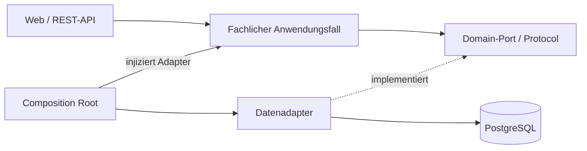

# Fachdomänen, vertikale Slices und Abhängigkeitsumkehr

Benutzerentscheidung vom 21. September 2026; Bezug M01–M07, N10. Die fachlichen
Komponenten users, devices, repairs, parts und costs bleiben erhalten. Ihre
Python-Pakete unter `app.domains` bilden den frameworkfreien Kern. Fachlogik
kennt weder Flask noch SQLAlchemy, PostgreSQL oder konkrete Adapter.

Diese Entscheidung ersetzt die bisherigen direkten Importkanten von Services
zu `app.data`. Der fachliche Ablauf bleibt gleich; die Quellcode-Abhängigkeit
wird umgedreht. Das ursprüngliche Word-Dokument und die Originaldiagramme bleiben als
bisheriger Entwurf erhalten. Der T13-Abgleich liegt in den
[aktuellen Diagrammen](diagrams/README.md) und der
[technischen Word-/PDF-Arbeitsfassung](submission/README.md). Die folgenden
T03-/T04-Abschnitte halten historische Zwischenstände fest; spätere explizite
Benutzerentscheidungen in diesem Dokument haben Vorrang.

## Verträge und Verdrahtung

- Jeder Anwendungsfall definiert seine benötigten Ports im eigenen Fachpaket
  (`ports.py` im jeweiligen Slice) als `typing.Protocol`. Kleine Interfaces werden vom Bedarf des
  Aufrufers bestimmt, nicht von SQLAlchemy oder einer universellen CRUD-Basis.
- Eingaben, Ergebnisse und fachliche Wertobjekte sind normale Python-Typen,
  beispielsweise unveränderliche Dataclasses und `Decimal`. Austauschobjekte
  in `dto.py` haben keine ORM-Basisklasse und laden keine Daten implizit nach.
- Repository-/Transaktionsadapter in `app.data` implementieren die Ports und
  übersetzen zwischen ORM-Modellen und fachlichen Datentypen. Sie dürfen Ports
  und DTOs importieren, aber keine Anwendungsfälle aufrufen. Transaktionsgrenzen
  werden über einen injizierten Unit-of-Work-Port gesteuert, wo atomare Abläufe
  dies benötigen; Rollback erfolgt im konkreten Adapter.
- Services erhalten Ports explizit im Konstruktor oder als Funktionsparameter.
  Keine Globals, Service-Locator, `current_app`, `db.session`, Requests oder
  Sessions im Fachkern. Der Benutzer wird als bereits ermittelte Identität
  übergeben; Eigentumsprüfung bleibt im zuständigen Anwendungsfall.
- `app.bootstrap.create_app` ist die Composition Root: Sie baut konkrete Adapter
  und injiziert sie in Services. Flask-Routen erhalten die fertig verdrahteten
  Anwendungsfälle und übersetzen HTTP-Eingaben und Ergebnisse. Ein Zugriff auf
  Flask-Kontext zur Bereitstellung der Instanzen bleibt auf die Präsentation
  beschränkt. Niemals globale DB-Sessions als langlebige Abhängigkeit injizieren.
- Flask-Login und HTTP-Sitzungen gehören zur Präsentation/technischen Anbindung.
  Passwort-Hashing, Token-Signatur und Uhrzeit erhalten bei Bedarf eigene Ports
  in users; deren konkrete Bibliotheken werden ausschliesslich in äusseren
  Adaptern verwendet. Neue technische Adapterpakete werden mit ihrer Einführung
  ausdrücklich in der Architekturprüfung zugeordnet.
- Kostenberechnung bleibt eine reine Funktion ohne Repository. Die erlaubten
  Aufrufe repairs → costs und parts → costs bleiben bestehen. Zwischen den
  übrigen Fachkomponenten entstehen keine neuen Abhängigkeiten.



Ports und Implementierungen werden zusammen mit einem tatsächlichen Anwendungsfall
entwickelt. T03 enthält noch keine Benutzer-/Geräte-/Reparaturfunktionen: Es wurden
bewusst keine leeren Repository-Interfaces oder vorgezogenen Fachservices ergänzt.
Ab T04 entstehen fachliche Typen, Ports, Adapter und Verdrahtung jeweils aus
dem konkreten Anwendungsfall; ORM-Modelle werden daraus abgeleitet. Auch technische Bereitschaftsdiagnose und
Flask-Konfiguration gehören nicht zum Fachkern und dürfen Infrastruktur verwenden.

## Bereits umgesetzt und geprüft

Die Paketwurzel `app/__init__.py` lädt Flask erst beim Aufruf von `create_app`.
Damit importiert ein Domain-Import nicht mehr indirekt Flask/SQLAlchemy über die
Application Factory. Der Gunicorn-/Flask-Einstieg `app:create_app` bleibt erhalten.

Die CI-Architekturprüfung verbietet in allen fünf Fachpaketen konkrete Datenzugriffe,
Flask-Erweiterungen und andere Nicht-Standardbibliotheken. Erlaubte interne Imports
folgen weiterhin den Komponentengrenzen. Datenadapter dürfen ausschliesslich Ports
und DTOs der vier persistierenden Fachkomponenten importieren. Neue Bibliotheken
im Fachkern brauchen eine explizite, begründete Änderung dieser Regel.

Positive und negative Architekturtests prüfen diese Grenzen. Ein separater Python-
Prozess ohne `site-packages` importiert sämtliche Fachpakete erfolgreich. Zukünftige
Domain-Unit-Tests verwenden Fake-Repositories, Fake-UoWs und kontrollierte Uhren ohne
App-Kontext oder Datenbank. Adaptertests prüfen dieselben Port-Verträge gegen echtes
PostgreSQL; Integrationstests prüfen die Verdrahtung und HTTP-Übersetzung.


## Vertikale Slices: Domäne und Anwendungsfall zuerst

Zusätzliche Benutzerentscheidung vom 21. September 2026: Die Fachdomänen stehen
im Zentrum der Struktur. `app.services` wurde nach `app.domains` verschoben;
die fünf fachlichen Verantwortlichkeiten bleiben erhalten. Das ersetzt die
bisherige Paketzuordnung im ursprünglichen Implementierungsplan. Es gibt keine
Kompatibilitätsfassade unter `app.services`.

Die derzeit noch leeren Fachpakete erhalten mit jedem Funktionstask Slices nach
Anwendungsfall. Folgende Struktur zeigt die Zielkonvention, **keine bereits
implementierten Funktionen**:

```text
app/
  domains/
    users/
      register_user/
        handler.py       # Anwendungsfall, Abhängigkeiten explizit injiziert
        ports.py         # Nur die benötigten Fähigkeiten der Adapter
        dto.py           # Eingabe und Ergebnis, ohne HTTP-/ORM-Typen
    devices/
      register_device/
    repairs/
      model.py           # Gemeinsam benötigte fachliche Typen, z.B. Status
      create_repair/
      change_status/
      add_step/
      get_repair/
    parts/
      add_part/
      update_part/
    costs/               # Reine Berechnung; kein künstlicher Repository-Slice
  web/                   # HTML-/Formularadapter, nach Domäne/Anwendungsfall
  api/                   # JSON-/Tokenadapter, gleiche fachliche Anwendungsfälle
  data/                  # ORM-/Transaktionsadapter, nach Domäne/Anwendungsfall
  bootstrap.py           # Einziger Ort der konkreten Verdrahtung
```

Ein Slice enthält den fachlichen Ablauf samt seiner spezifischen Verträge.
Keine domänenweiten Sammeldateien wie `services.py` mit allen Anwendungsfällen
und keine zentralen Verzeichnisse aller Commands, Handler oder DTOs. Kleine
Anwendungsfälle benötigen weder eine Klassenhierarchie noch CQRS-/Mediator-
Bibliotheken. Funktionen mit expliziten Abhängigkeiten sind ausreichend.

Ein Slice ruft keinen anderen Slice auf und importiert keine fremden Slice-DTOs.
Nur tatsächlich gemeinsam benötigte fachliche Regeln und Typen dürfen innerhalb
derselben Domäne in `model.py`, `errors.py` oder gemeinsamen Verträgen leben.
Diese gemeinsamen Module dürfen ihrerseits keine Slices importieren. Die bestehenden
ausdrücklichen Abhängigkeiten repairs/parts → costs bleiben erlaubt.

Vertikal bedeutet hier auch einen vollständigen Arbeitszuschnitt: Zu einem
Anwendungsfall gehören passende HTTP-/DOM-Adapter, Datenadapter und Tests.
Die Adapter liegen aus Gründen der Framework-Unabhängigkeit ausserhalb des
Fachkerns und spiegeln Domäne und Anwendungsfall in ihrer Struktur wider, z.B.
`app.data.repairs.create_repair`. Die Domain entscheidet über die benötigten
Schnittstellen. ORM-Tabellen sind nicht die Vorlage für die Anwendungsfälle.

Tests folgen derselben Gliederung, etwa
`tests/unit/domains/repairs/create_repair/`. Datenadapter werden mit PostgreSQL
unter Integration getestet, der vollständige Nutzerablauf unter E2E. Bereits T04
liefert einen vollständigen Registrierungsslice; T05 ergänzt Anmeldung/Abmeldung.
T06–T09 erweitern die Anwendung um die weiteren fachlichen Anwendungsfälle.

## Prüfung dieser Strukturänderung

`pytest tests/unit tests/integration/app/test_factory.py
 tests/integration/app/test_errors.py -q`: **333 bestanden** am 21. September 2026.
Ruff und Architekturprüfung bestanden. Zusätzliche positive/negative Tests prüfen
Imports innerhalb eines Slice, gemeinsame fachliche Typen, Slice-Ports für Adapter
und verbotene Querverbindungen. Alle fünf Domänen lassen sich weiterhin in einem
separaten Prozess ohne installierte Framework-/Datenbankbibliotheken importieren.
Es wurden keine Fachfunktionen vorgezogen. Kein erneuter Image-Build, Security-Scan
oder Deployment für diese Paketverschiebung ausgeführt.


## Fachlicher Bedarf bestimmt das Schema

Präzisierung auf Benutzerwunsch: Kein vorgeschalteter Task für alle fünf Tabellen.
Zuerst ein fachliches Beispiel und seine Regeln, dann ein frameworkfreier
Anwendungsfall mit Ports und Fake-Adaptern. Erst anschliessend werden konkrete
Adapter und die minimal benötigte Migration entwickelt. Der Slice endet mit
Browser-/API-Anbindung und Integrationstests, nicht bereits mit den Domain-Tests.

Nächster Task ist T04 «Benutzer registrieren», gefolgt von Anmeldung/Abmeldung
in T05 und den Geräte-/Reparaturanwendungsfällen. Das vorhandene ERD dient zum
Abgleich der vereinbarten Anforderungen. Fachliche Widersprüche werden geklärt;
Tabellen und Spalten werden nicht allein deshalb vorab implementiert, weil sie
im Entwurf stehen. Constraints, Transaktions-Rollback und Datenerhalt bleiben
Abnahmekriterien der jeweils betroffenen Slices.


## T04: Standard-Identitätsverwaltung als äussere Integration

Neuere ausdrückliche Benutzerentscheidungen ersetzen die geplante Eigenregistrierung:
Flask-Security übernimmt den vollständigen Registrierungs-/Bestätigungsablauf sowie
die mitgelieferten Login-/Logout-Funktionen. E-Mail-Verifikation ist nun erforderlich,
E-Mail-Adressen sind eindeutig. Diese generische Identitätsverwaltung wird nicht als
eigene fachliche Kryptografie oder nachgebildeter Domain-Handler implementiert.

- `app.adapters.users.security` initialisiert die Bibliothek und kapselt Mailfehler
  sowie die zusätzliche CSRF-Absicherung der POST-Abmeldung.
- `app.data.users` enthält ausschliesslich technische Bibliotheksmodelle und deren
  Datastore. Die benötigten Rollen-/Zuordnungstabellen sind technische Voraussetzungen;
  es werden keine Rollen vergeben oder Administratorfunktionen angeboten.
- `app.domains.users.ports.IdentityProvider` und der unveränderliche
  `UserIdentity`-DTO sind frameworkfrei. `FlaskSecurityIdentity` implementiert den
  Vertrag und liefert nur angemeldete, bestätigte Identitäten. Eigene Vorlagen
  erhalten diesen DTO; künftige fachliche Slices erhalten die Identität injiziert.
- Der Bibliotheks-Blueprint darf seine eigene Identitätspersistenz verwenden.
  Eigene Web-/API-Routen dürfen weiterhin weder ORM-Modelle noch Datenbank-Sessions
  importieren. Die Paketgrenzen der Reparaturdomänen werden nicht gelockert.

Die vorangehende Beschreibung eines eigenen `register_user/handler.py` ist eine
Zielkonvention für fachliche Slices, kein Auftrag zur erneuten Implementierung der
jetzt delegierten Authentifizierung. Anwendungsfall → benötigte Infrastruktur gilt
weiterhin: Die neue Migration schafft nur die für diese Integration erforderlichen
Identitätstabellen, keine vorgezogenen Geräte-/Reparaturtabellen.

## Benutzerentscheidung: injizierte Benutzeranwendungsfälle

Die oben beschriebene T04-Ausnahme für einen direkten Bibliotheks-Blueprint ist
auf Benutzerauftrag vom 21. September 2026 aufgehoben. Auch die standardisierten
Benutzerabläufe haben nun frameworkfreie Handler und Slice-Ports. Eigene Routen
rufen diese tatsächlich auf; Flask-Security liefert die technische Implementierung
im injizierten Adapter. Details und Grenzen: [Benutzeranwendungsfälle](user-use-cases.md).
Neue Benutzerfunktionen müssen diesen Aufrufweg beibehalten; das Vorhandensein
eines unbenutzten Domain-Wrappers genügt nicht.

## T06: Geräte-Slices und Browser-AJAX

`register_device`, `list_devices`, `get_device` und `update_device` bestimmen
Ports, Validierung und die minimale Gerätepersistenz. AJAX verwendet diese selben
Handler innerhalb der Webkomponente; es schafft keine zusätzliche schreibende
REST-API. Gemeinsame Eigentumsabfragen liegen im Datenzugriff. Einzelne atomare
Speicheroperationen werden vom jeweiligen Repository-Port gekapselt.
Details: [Geräteverwaltung](devices.md).

Der ergänzende Geräte-Slice `suggest_device_values` besitzt seinen eigenen
Repository-Port und Query-DTO. Er liefert ausschliesslich eigene gespeicherte
Gerätewerte für Autocomplete. Der konkrete Datenadapter kennt keine Handler;
Verdrahtung erfolgt in `app.bootstrap`. Keine Slice-Querverbindungen und kein
externer Produktkatalog; bestehende Architekturgrenzen bleiben unverändert.

## T07: Reparaturfälle und Schritte

Die sieben Reparatur-Slices `create_repair`, `list_repairs`, `get_repair`,
`update_description`, `change_status`, `add_step` und `update_step` besitzen
jeweils eigene Commands und Repository-Ports. Gemeinsame DTOs und Regeln bleiben
sliceunabhängig. Die injizierte Uhr gehört zur Fallerstellung. Datenadapter prüfen
Eigentum über Gerät und Fall und kapseln atomare Schreiboperationen; Handler
importieren keine Geräteslices. Die Webkomponente darf für die Formularanzeige
zusätzlich den vorhandenen Geräte-Handler verwenden. Composition Root bleibt
`app.bootstrap`. AJAX und normales HTML benutzen dieselben Anwendungsfälle.
Keine neuen Fachabhängigkeiten; Kosten und Teile folgen in T08.
Details: [Reparaturverwaltung](repairs.md).


Der Reparatur-Slice `list_repairs` akzeptiert nun ein begrenztes Fenster und eine
obere Fall-ID für virtuelle Listen. Der Eigentumsfilter gilt auch für Maximum,
Gesamtzahl und jedes AJAX-Fenster. Diese Erweiterung verwendet weiterhin nur den
eigenen Repository-Port; keine Abhängigkeit zur Geräte-Domäne. Das gemeinsame
Scrollverhalten liegt ausschliesslich in der Präsentation.

## T08: Ersatzteile, Arbeitswerte und reine Kostenberechnung

`parts.add_part`, `parts.update_part` und `repairs.update_work` sind eigenständige
Slices mit explizit injizierten Repository-Ports. `repairs.get_repair` berechnet
Kosten über `costs.model.calculate`; auch Teile-Handler beziehen ihren
Positionsbetrag von derselben Funktion. Die Kostenkomponente kennt ausschliesslich
Standardbibliothek und übergebene Werte, keine Repository-Ports oder Persistenz.
Keine Imports zwischen Reparatur- und Teiledomäne. Eigene DTOs der Fallauskunft
tragen die benötigten Positionswerte. Einzelheiten: [Teile und Kosten](parts-and-costs.md).

## T09: API-Key-Verwaltung und gemeinsame Fallauskunft

Die Benutzer-Slices `create_api_key`, `get_api_key`, `revoke_api_key` und
`authenticate_api_key` delegieren über eigene Ports an `app.adapters.users.api_keys`.
Zufall, Hashing und Identitätspersistenz bleiben ausserhalb der Domäne.
Die Webschicht erhält die Verwaltungs-Handler, die API nur Authentifizierung und
die bestehenden `repairs.list_repairs`/`repairs.get_repair`-Anwendungsfälle.
Keine zusätzlichen Fachabhängigkeiten. Migration 0005 folgt der konkreten
Schlüsselverwaltung. Diese Benutzerentscheidung ersetzt die vorherige T09-
Token-Ausstellung samt Passwortübergabe. Details: [API](api.md).

### Benutzerentscheidung: zentraler System-Lesezugang

`API_SMOKE_KEY` authentifiziert eine `SystemApiIdentity` ohne Benutzerkonto.
Die API übersetzt diese technische Identität in die explizite Reparaturberechtigung
`SystemReadAccess.ALL_REPAIRS`. Nur die beiden bestehenden Lese-Slices und ihre
Read-Adapter verstehen diese Berechtigung; `None`, ungültige Eigentümer und
Schreib-Slices erhalten dadurch keinerlei Sonderrechte. Die gemeinsamen
Eigentumsabfragen bleiben unverändert. Kosten werden weiterhin im selben
Anwendungsfall berechnet. Keine neue Fachabhängigkeit, Benutzerrolle oder
Migration. Diese ausdrücklich gewünschte Ausnahme ersetzt für den Systemschlüssel
die bisherige Beschränkung auf eigene Fälle. Persönliche Keys bleiben gebunden.

## K-T04: Bildspeicherung

Die Slices `upload_image`, `list_images` und `get_image` bleiben getrennt in Geräte-
und Reparaturdomäne. Injizierte Ports kapseln Bildverarbeitung, Metadaten und privaten
Objektspeicher. Technische Adapter unter `app.data.files` verwenden Pillow und boto3;
Flask-Routen erhalten ausschliesslich verdrahtete Anwendungsfälle. Der auf ausdrücklichen
Benutzerwunsch ergänzte Garage-Container erweitert die technische Bereitstellung,
nicht die fachlichen Abhängigkeiten. Details: [Bilder](images.md).

## K-T05: PDF als zusätzliche Darstellung

Der PDF-Download nutzt `get_repair(complete=True)` und den vorhandenen Geräte-Leseslice.
Keine neue Geschäftsregel wird implementiert; die Präsentation unter
`app.web.documents` erhält ausschliesslich autorisierte DTOs und gerundete Kosten.
Deshalb keine separate Export-Service-Schicht, keine Slice-zu-Slice-Imports und
keine zweite Kostenberechnung. Details: [PDF-Berichte](pdf-reports.md).
