# RepairHub – Benutzeranleitung

Mit RepairHub hältst du fest, welche Geräte du besitzt, was daran defekt ist und
wie die Reparatur vorankommt. Diese Anleitung führt dich vom eigenen Konto bis zum
fertigen Reparaturbericht. Alle gezeigten Daten gehören zu einem eigens angelegten
Demokonto. Die Screenshots zeigen die deutsche Oberfläche im echten Chromium-Browser.

**Anwendung:** <https://lab19.ifalabs.org> (HTTPS, Port 443).
Lokal erreichst du RepairHub nach der [Einrichtung](../../README.md#lokal-starten)
unter <http://127.0.0.1:8080>. Die Bedienung ist gleich.

## Schnell zum passenden Ablauf

- [Konto erstellen und E-Mail bestätigen](#1-konto-erstellen-und-e-mail-bestätigen)
- [Anmelden und abmelden](#2-anmelden-und-abmelden)
- [Passwort vergessen](#3-passwort-vergessen)
- [Geräte erfassen, bearbeiten und finden](#4-geräte-verwalten)
- [Reparatur anlegen und bearbeiten](#5-reparaturfälle-verwalten)
- [Schritte und Status nachführen](#6-reparaturschritte-und-status)
- [Ersatzteile und Kosten](#7-ersatzteile-und-kosten)
- [Bilder hinzufügen, öffnen und löschen](#8-bilder-zu-geräten-und-reparaturen)
- [Suche, Statusübersicht und lange Listen](#9-reparaturen-finden-und-den-überblick-behalten)
- [PDF herunterladen](#10-reparaturbericht-als-pdf)
- [API-Schlüssel verwalten und Daten lesen](#11-persönlicher-api-zugang)
- [Sprache, Mobilgeräte und Hilfe](#12-sprache-mobilgeräte-und-hilfe)

## 1. Konto erstellen und E-Mail bestätigen

Öffne die Startseite und wähle **Konto erstellen**. Du benötigst eine erreichbare
E-Mail-Adresse. Benutzername und E-Mail-Adresse dürfen noch keinem anderen Konto
zugeordnet sein.


1. Trage deinen Benutzernamen ein: 1–80 Buchstaben oder Ziffern.
2. Gib deine E-Mail-Adresse ein.
3. Wähle ein Passwort mit 8–128 Zeichen und wiederhole es genau.
4. Klicke auf **Registrieren**. Der Button wird erst freigegeben, wenn die
   Pflichtfelder vollständig sind, die E-Mail formal gültig ist und die beiden
   ausreichend langen Passwörter übereinstimmen.

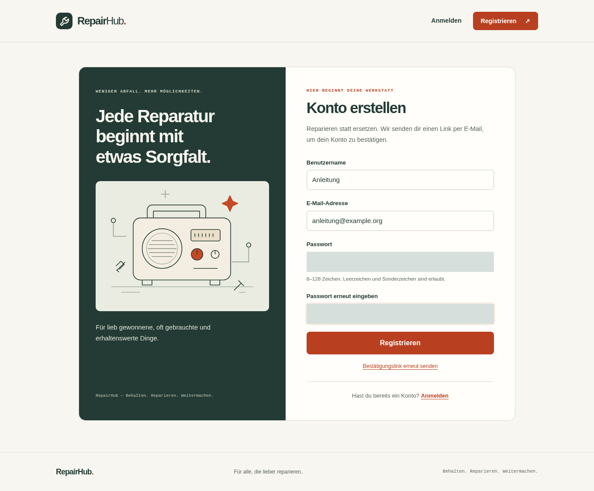

Die Rückmeldung nach dem Absenden ist noch keine Anmeldung. Öffne dein Postfach
und die Bestätigungsmail von RepairHub.


Klicke in der E-Mail auf den Bestätigungslink. Danach kannst du dich anmelden.
Der Link ist 24 Stunden gültig. Das folgende Bild zeigt die echte, lokal empfangene
HTML-Mail; ihr individueller Link wurde für die Dokumentation entfernt.

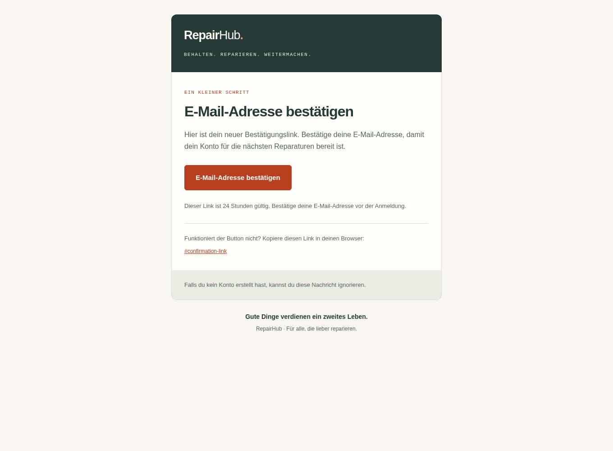

**Keine Nachricht erhalten oder Link abgelaufen?** Prüfe den Spamordner. Öffne
[Bestätigungslink erneut senden](https://lab19.ifalabs.org/confirm), gib dieselbe
E-Mail-Adresse ein und sende das Formular ab. Verwende den neu erhaltenen Link.

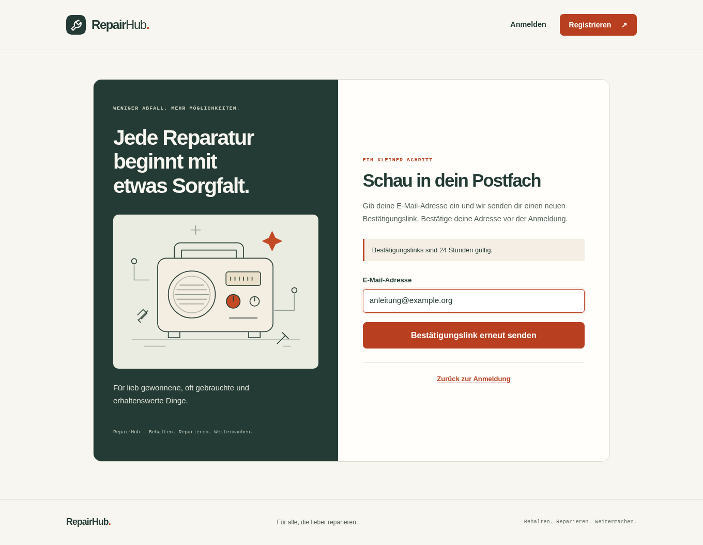

Bei lokaler Entwicklung findest du Nachrichten ausschliesslich im
[Mailpit-Postfach](http://127.0.0.1:8025); sie werden nicht ins Internet versendet.
Bei Problemen mit dem produktiven Mailversand muss der Betreiber die
SMTP-Konfiguration prüfen. Ohne Bestätigung bleibt die Anmeldung gesperrt.

## 2. Anmelden und abmelden

Öffne **Anmelden**. Gib im ersten Feld deine **E-Mail-Adresse oder deinen
Benutzernamen** und darunter dein Passwort ein. Klicke auf **Anmelden**.

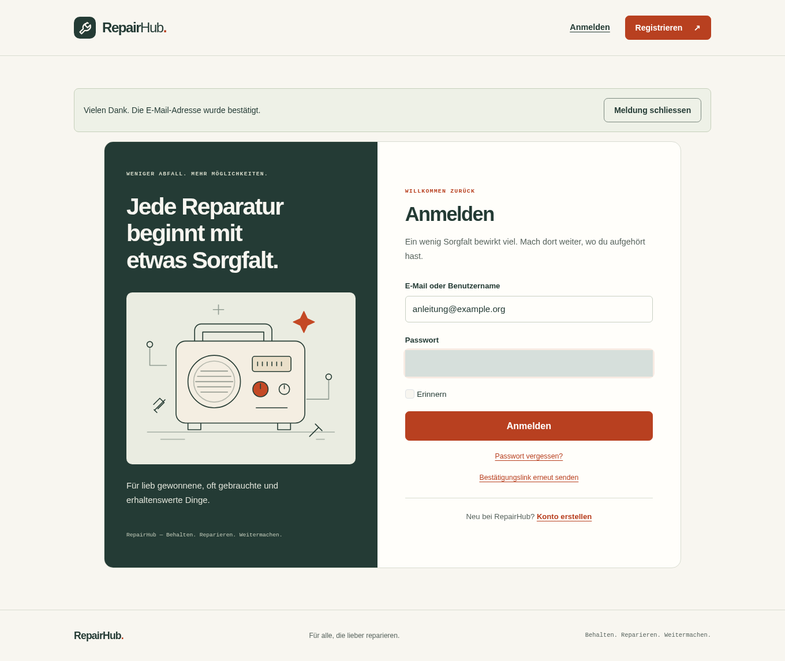

Nach der Anmeldung erreichst du über die Navigation **Deine Geräte**, **Deine
Reparaturen** und den **API-Zugriff**. Deine Geräte und Fälle sind nur für dein
Konto sichtbar. Der Betreiber besitzt zusätzlich einen gesonderten System-Lesezugang.

Zum Beenden wählst du **Abmelden** in der Navigation. Geschützte Seiten verlangen
danach wieder eine Anmeldung. Auf gemeinsam verwendeten Computern immer abmelden.

## 3. Passwort vergessen

Wähle auf der Anmeldeseite **Passwort vergessen?**.

1. Gib die E-Mail-Adresse deines Kontos ein.
2. Sende die Anfrage ab und öffne die erhaltene E-Mail.
3. Folge dem Link innerhalb einer Stunde.
4. Gib ein neues Passwort zweimal identisch ein und speichere es.
5. Melde dich mit dem neuen Passwort an.

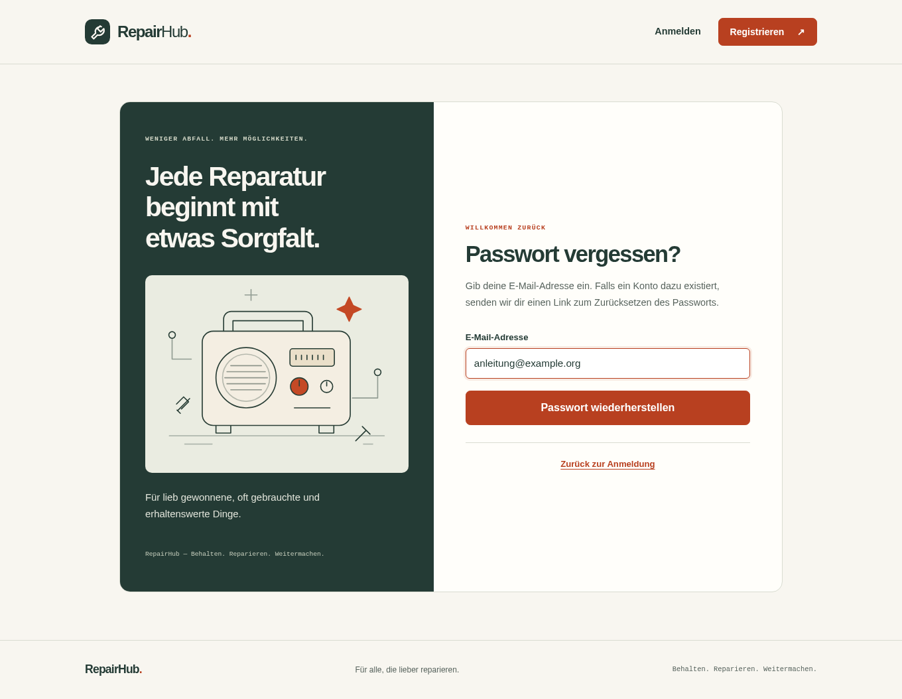

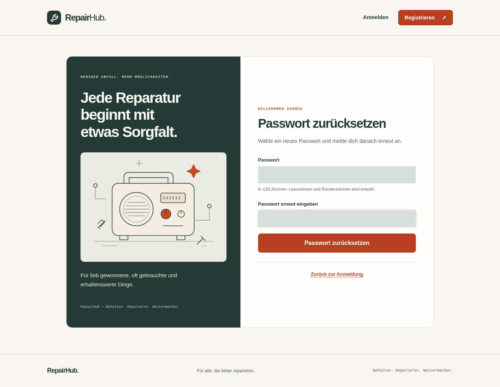

Aus Datenschutzgründen lässt die allgemeine Rückmeldung nicht erkennen, ob eine
Adresse registriert ist. Bei einem abgelaufenen Link fordere eine neue Nachricht an.

## 4. Geräte verwalten

Die Geräteübersicht zeigt anfangs einen leeren Zustand. Wähle **Gerät hinzufügen**.

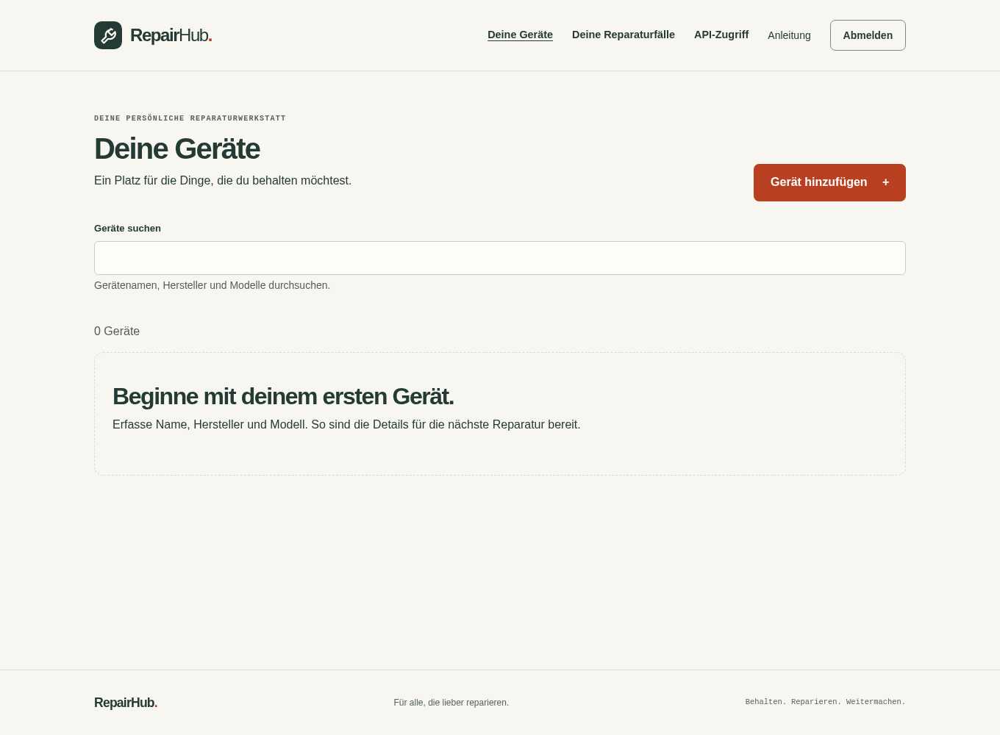

### Gerät hinzufügen

Trage **Gerätename**, **Hersteller** und **Modell** ein. Verwende einen Namen,
den du später gut wiedererkennst, beispielsweise «Werkstattradio».
Alle drei Angaben sind erforderlich. Klicke auf **Gerät speichern**.

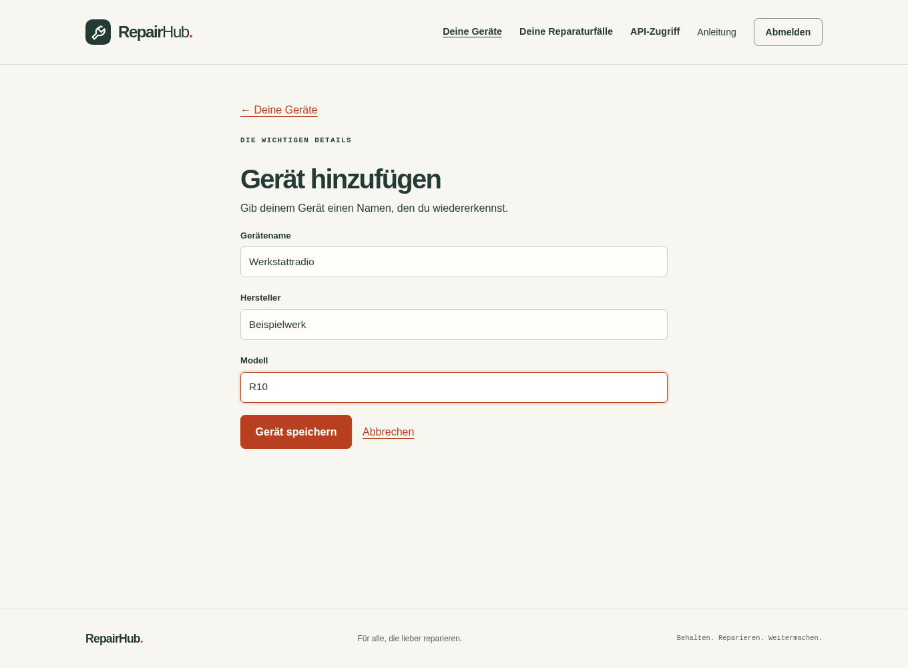

Warte auf die Erfolgsmeldung. Wähle danach **Gerät ansehen**, um das gespeicherte
Gerät zu öffnen. Während des Speicherns ist kein zweiter Klick nötig.

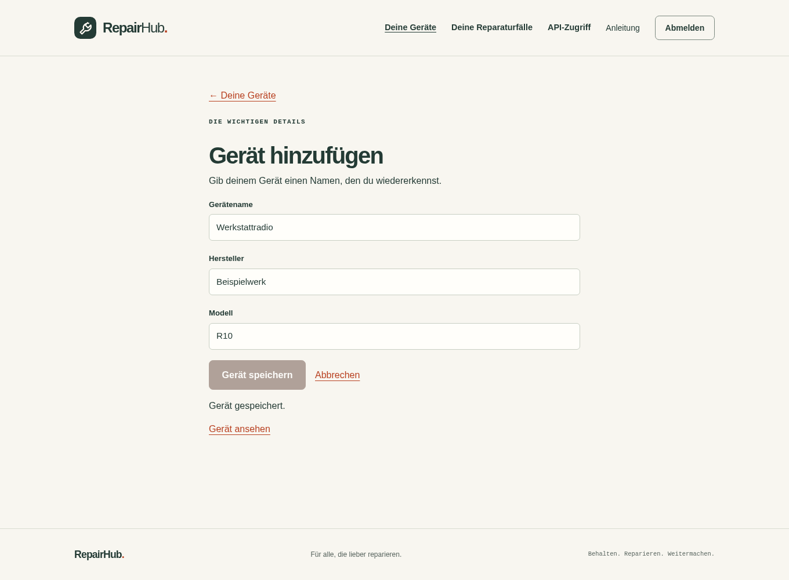

### Vorschläge verwenden

Beim Tippen erscheinen passende Werte aus deinen bereits gespeicherten Geräten.
Gross-/Kleinschreibung und Position im Text spielen keine Rolle. Wähle einen
Vorschlag mit der Maus oder den Pfeiltasten und Enter. Ist kein passender Wert
vorhanden, tippe deinen eigenen. Nach dem Speichern steht er für spätere Geräte
zur Verfügung. Die Vorschläge stammen nicht aus einem externen Produktkatalog.

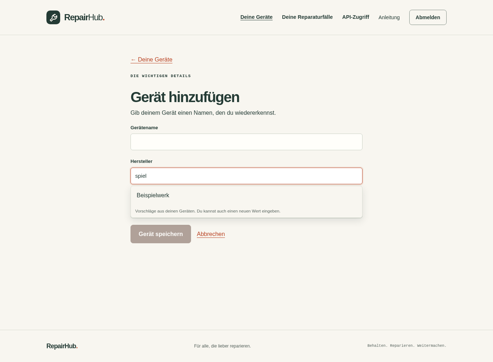

### Gerät bearbeiten

Öffne das Gerät und wähle **Gerät bearbeiten**. Ändere die gewünschten Angaben
und klicke auf **Gerät speichern**. Bei leeren Pflichtfeldern oder unveränderten
Angaben bleibt der Button deaktiviert. Prüfe nach dem Speichern die Rückmeldung.

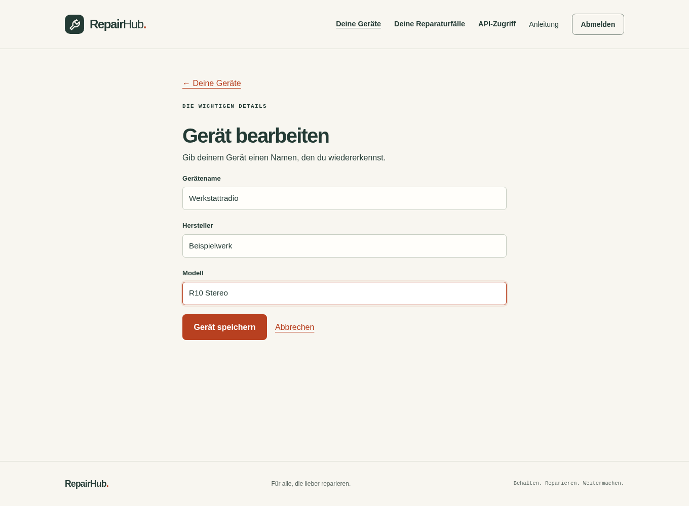

### Gerät suchen und lange Listen benutzen

Gib in der Geräteübersicht einen oder mehrere Suchbegriffe ein. Die Suche umfasst
Name, Hersteller und Modell. Mehrere Wörter müssen gemeinsam passen; die Reihenfolge
und Gross-/Kleinschreibung sind unwichtig. Nach kurzer Eingabepause erscheinen die
Treffer automatisch, ohne Enter.

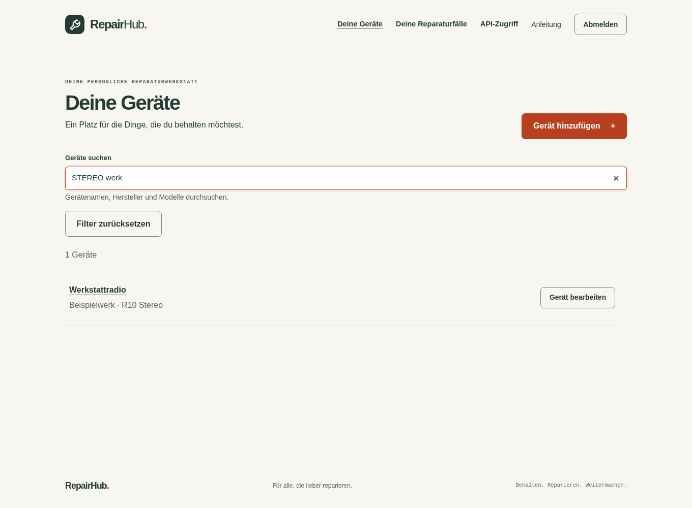

Scrolle **innerhalb der Geräteliste** nach unten, um weitere Geräte zu laden.
Die Liste hält nur einen Ausschnitt im Browser. Nach dem Öffnen eines Geräts führt
**← Deine Geräte** zur Liste zurück und stellt die vorherige Scrollposition wieder
her. Eine neue Suche beginnt oben. **Filter zurücksetzen** entfernt die Suchbegriffe.

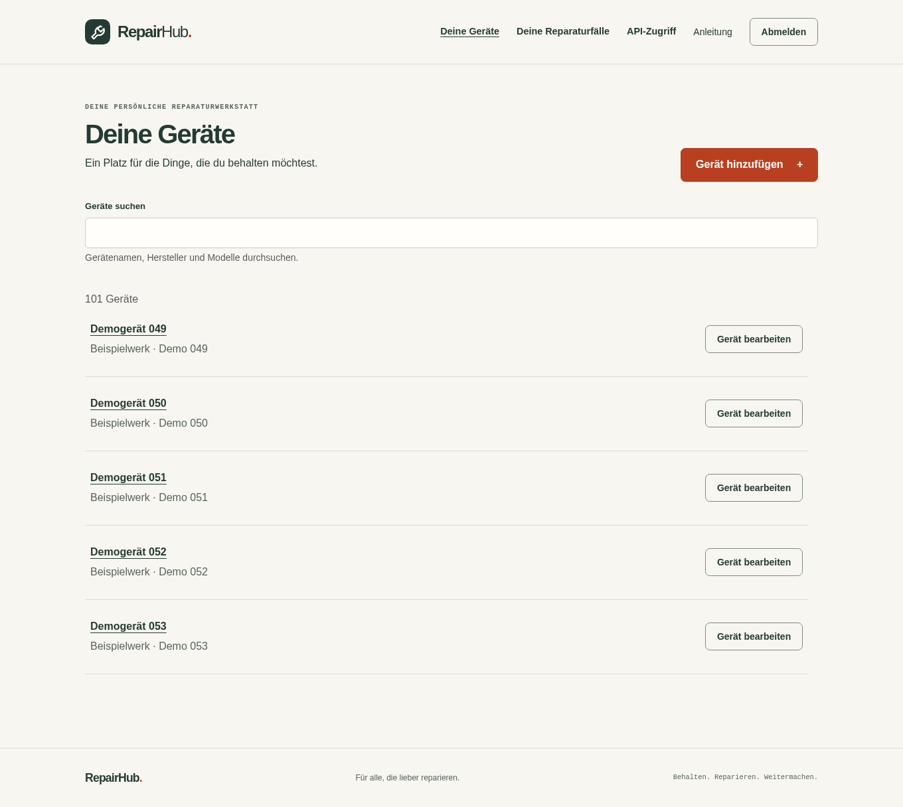

## 5. Reparaturfälle verwalten

Öffne das betroffene Gerät. Unter **Reparaturfälle für dieses Gerät** kannst du
vorhandene Fälle ansehen oder mit **Neuer Reparaturfall** einen Fall erstellen.

Beschreibe das beobachtete Problem, beispielsweise «Radio schaltet ein, aber aus
dem Lautsprecher kommt kein Ton». Speichere das Formular. Der neue Fall erhält
automatisch den Status **Offen**.

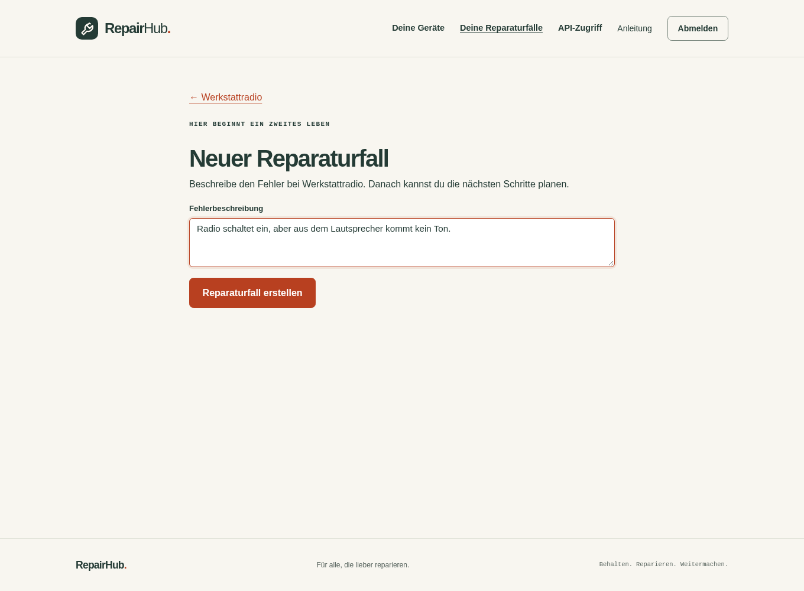

Im Reparaturdetail kannst du die Fehlerbeschreibung jederzeit ergänzen. Klicke
anschliessend auf **Beschreibung speichern**. Jeder Bereich besitzt seinen eigenen
Speicherbutton: Eine Änderung am Status speichert beispielsweise keine noch nicht
abgeschickte Beschreibung.

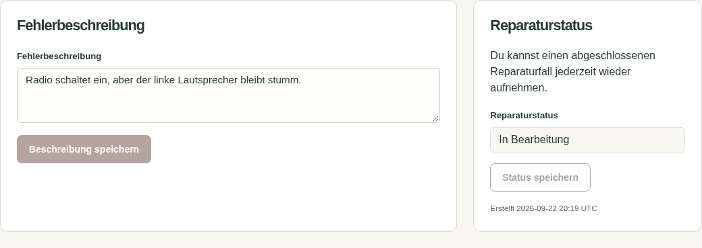

## 6. Reparaturschritte und Status

Unter **Schritt hinzufügen** beschreibst du eine konkrete Tätigkeit und klickst auf
**Schritt hinzufügen**. Wiederhole das für die nächsten Tätigkeiten.

Bei vorhandenen Schritten kannst du den Text ändern und **Erledigt** markieren.
Klicke anschliessend auf **Schritt speichern**. Entferne die Markierung und speichere
erneut, wenn der Schritt doch noch offen ist. Bei mehr als 20 Schritten erreichst
du weitere Einträge über die Schritt-Seitenlinks.

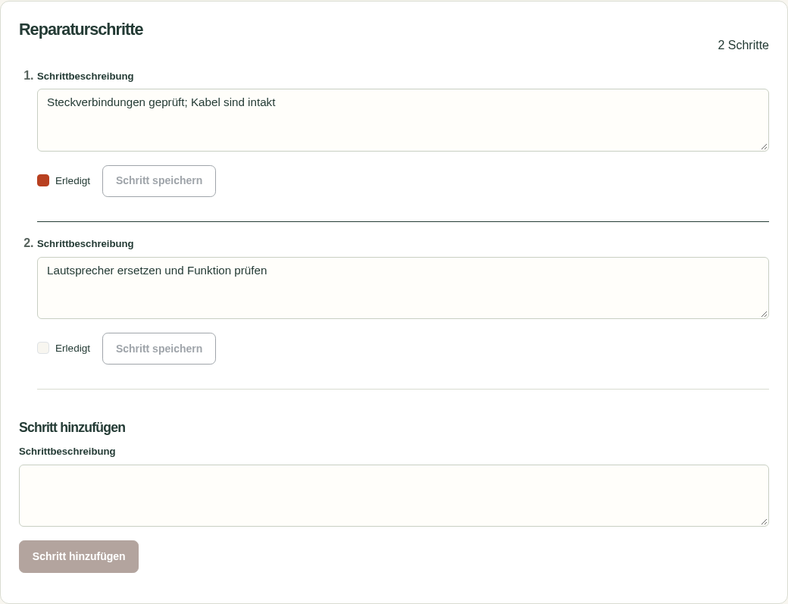

Wähle im Bereich **Reparaturstatus** den passenden Zustand und klicke auf
**Status speichern**:

| Status | Bedeutung für deine Dokumentation |
| --- | --- |
| Offen | Neu erfasst, Bearbeitung noch ausstehend. |
| In Bearbeitung | Du arbeitest am Fall. |
| Abgeschlossen | Die Bearbeitung ist für dich beendet. |

Ein abgeschlossener Fall kann wieder auf **In Bearbeitung** oder **Offen** gesetzt
werden. Der Fallstatus und die Erledigt-Markierungen einzelner Schritte werden
getrennt gepflegt.

## 7. Ersatzteile und Kosten

Die Kostenschätzung entsteht aus Arbeitszeit, Stundensatz und Ersatzteilpositionen.
Sie ist keine Rechnung und wird nach dem Speichern automatisch aktualisiert.

### Arbeitswerte speichern

Trage unter **Geschätzter Arbeitsaufwand** die Stunden und den Stundensatz in CHF ein.
Klicke auf **Arbeitsaufwand speichern**. Verwende nichtnegative Zahlen mit höchstens
zwei Nachkommastellen. Im Beispiel ergeben 2 Stunden zu CHF 80 Arbeitskosten von
CHF 160.00.

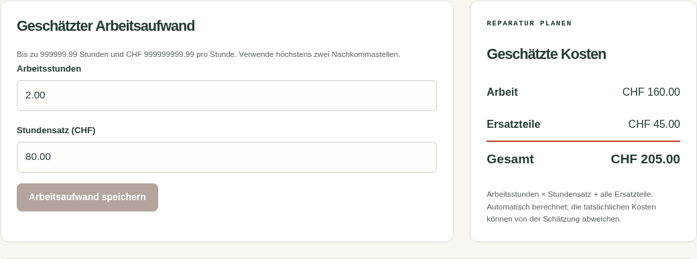

### Ersatzteil hinzufügen und bearbeiten

Unter **Ersatzteil hinzufügen** trägst du Bezeichnung, Einzelpreis in CHF und Menge
ein. Klicke auf **Ersatzteil hinzufügen**. Die Menge muss eine ganze Zahl ab 1 sein;
der Einzelpreis darf 0 sein, aber nicht negativ.

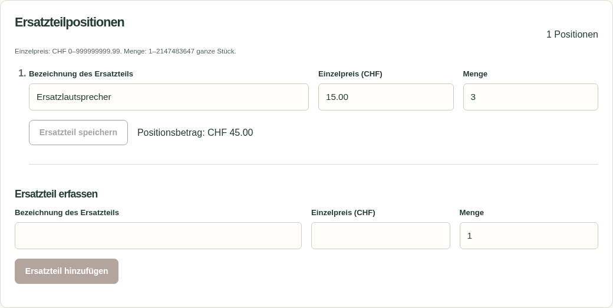

Bearbeite eine vorhandene Position direkt in ihren Feldern und klicke auf
**Ersatzteil speichern**. Bei mehr als 20 Positionen verwendest du die
Seitenlinks im Ersatzteilbereich.

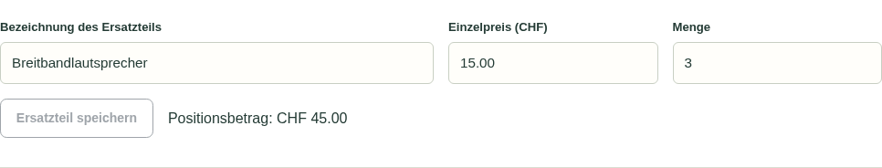

**Rechenbeispiel:** 2 × CHF 80 + 3 × CHF 15 = **CHF 205.00**.
Die Gesamtsumme lässt sich nicht direkt überschreiben. Ändere dafür die Arbeitswerte
oder die Ersatzteilpositionen. Oberfläche, API und PDF nutzen dieselbe Berechnung.

## 8. Bilder zu Geräten und Reparaturen

Sowohl Gerätedetails als auch Reparaturdetails besitzen einen Bildbereich.
Nach dem erstmaligen Anlegen eines Falls über AJAX lade die Detailseite einmal
neu oder öffne den Fall erneut aus der Liste, damit der Bildbereich erscheint.

1. Wähle eine Datei auf deinem Computer aus.
2. Klicke auf den Upload-Button und warte auf die Rückmeldung.
3. Wiederhole den Vorgang für weitere Bilder. Sie erscheinen als Mosaik.
4. Klicke auf ein Vorschaubild, um das vollständige Bild zu öffnen.

Erlaubt sind **JPEG, PNG und WebP**, höchstens **10 MiB** und **20 Megapixel** je
Bild. Animierte Bilder, PDFs und andere Dateien werden abgewiesen. Bilder werden
neu kodiert; sie sind kein Archiv der unveränderten Originaldatei.

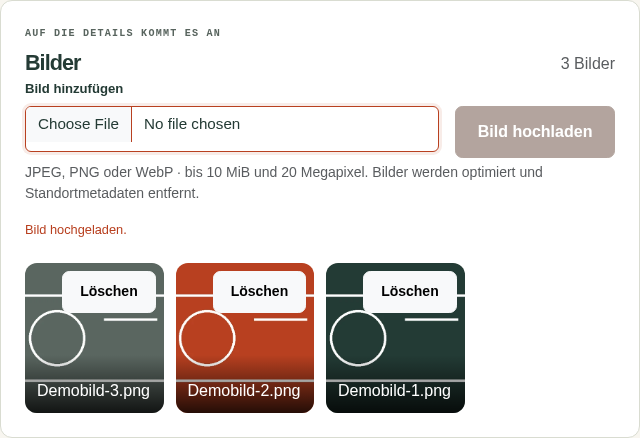

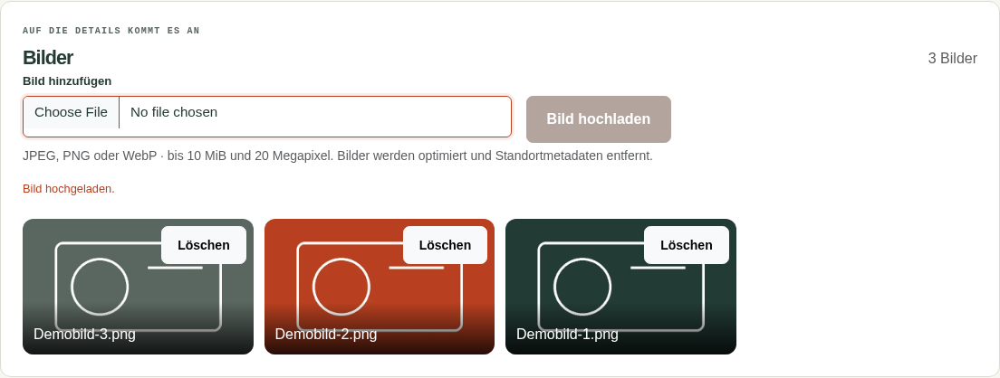

Zum Entfernen öffnest du **Bild löschen** am betroffenen Bild und bestätigst die
Aktion. Danach ist es in der Anwendung nicht mehr abrufbar. Sichere ein benötigtes
Original vorher separat. Bereits vorhandene Backups und die interne Aufbewahrung
im Objektspeicher sind davon unabhängig.

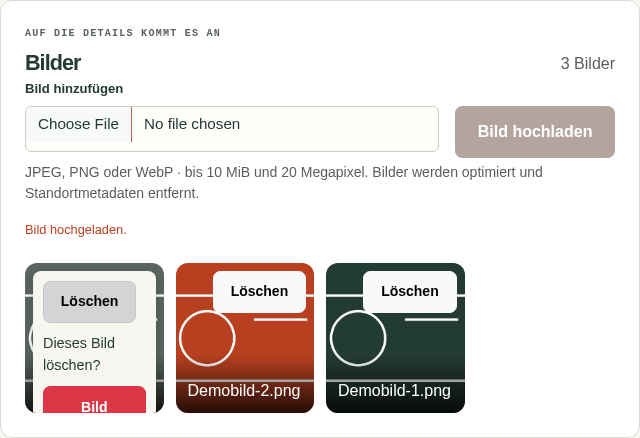

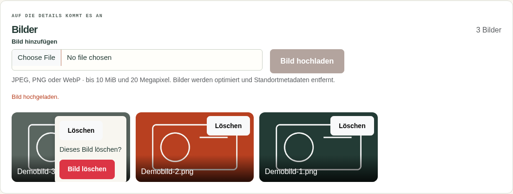

Pro Galerieseite werden höchstens 24 Bilder angezeigt. Weitere Bilder erreichst du
über die Seitenlinks. Gerätebilder und Fallbilder sind getrennte Zuordnungen.

## 9. Reparaturen finden und den Überblick behalten

Öffne **Deine Reparaturfälle**. Die drei Statuskarten zählen alle deine Fälle – auch
wenn du die darunterliegende Liste filterst. Nach Statusänderungen erhältst du die
aktuellen Zahlen beim erneuten Öffnen der Übersicht.

Gib einen Suchbegriff zur Fehlerbeschreibung, zum Gerätenamen, Hersteller oder
Modell ein. Nach etwa 300 ms Eingabepause wird gesucht. Wähle zusätzlich einen
Status; dieser Filter wirkt sofort. Ein separater Anwenden-Button ist mit
JavaScript nicht nötig.

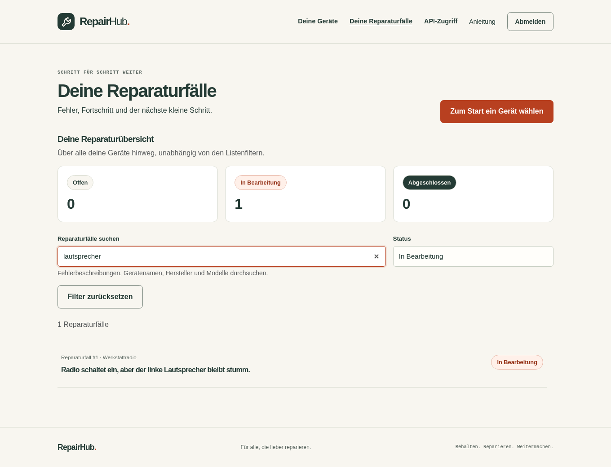

Ohne Treffer zeigt die Liste einen Hinweis. Korrigiere die Eingabe oder wähle
**Filter zurücksetzen**, um Suche und Statusfilter zu entfernen.

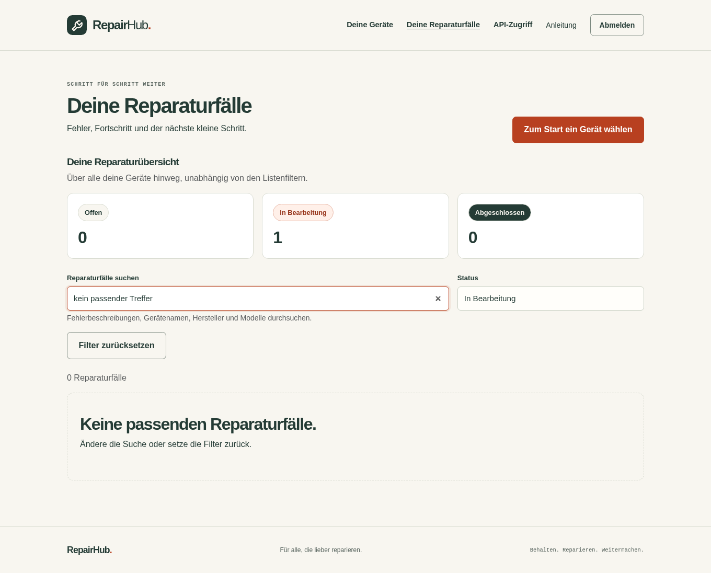

Scrolle innerhalb der Fallliste, um weitere Einträge nachzuladen. Öffne einen Fall
und kehre über **← Deine Reparaturfälle** zurück: Filter und Scrollposition bleiben
erhalten. Die folgenden Demofälle wurden nur zur Darstellung der langen Liste angelegt.

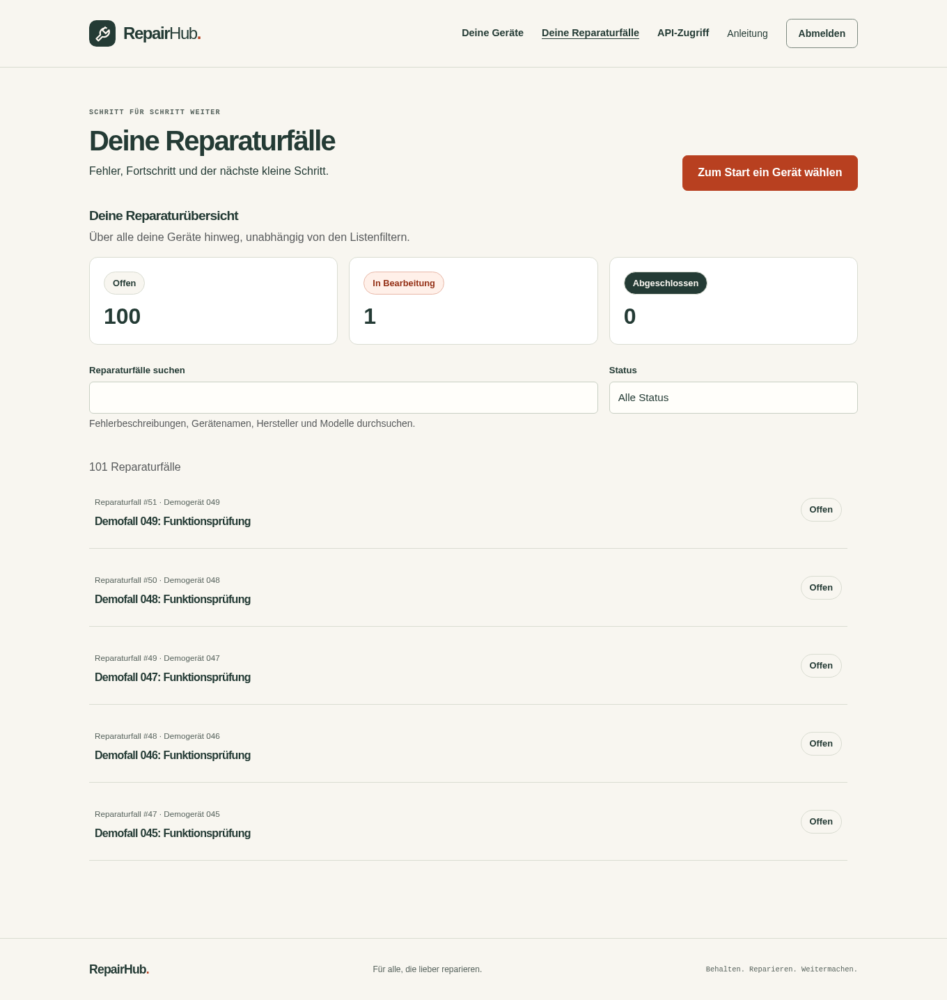

## 10. Reparaturbericht als PDF

Öffne den gewünschten Fall und klicke oben auf **PDF-Bericht herunterladen**.
Der Browser lädt die Datei herunter; öffne sie über seine Downloadliste.


Der Bericht enthält Gerät, Fehlerbeschreibung, Status, alle Schritte und
Ersatzteile sowie die aktuelle Kostenschätzung. Auch Einträge auf weiteren
Schritt- oder Ersatzteilseiten sind enthalten. Bilder werden nicht eingebettet.
Der Bericht verwendet die vom Browser angeforderte Sprache und Zeitangaben in UTC.

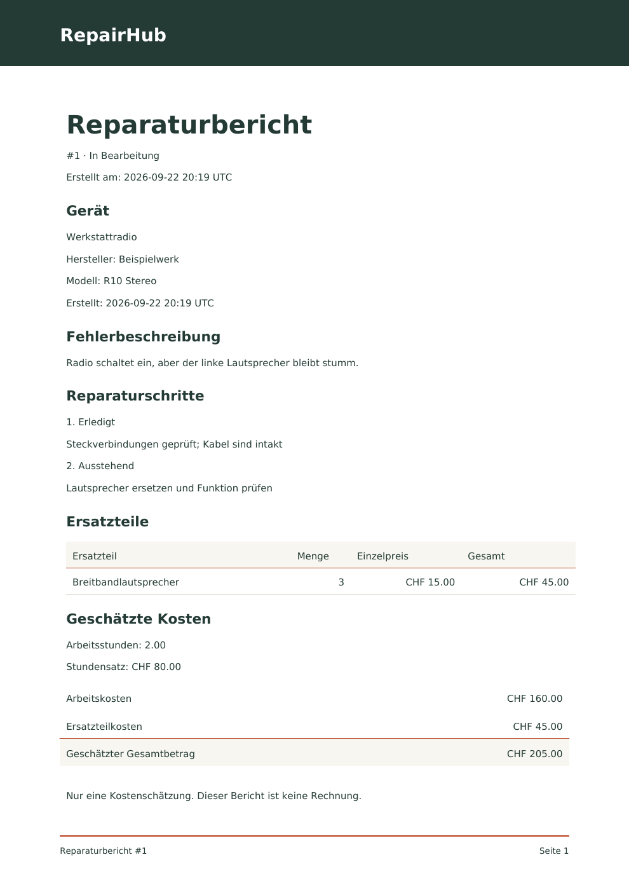

[Beispielbericht mit CHF 205.00 öffnen](example-repair.pdf).

## 11. Persönlicher API-Zugang

Über den **API-Zugriff** in der Navigation kannst du einen persönlichen API-Schlüssel
erstellen. Damit liest ein anderes Programm deine Reparaturen ohne Browseranmeldung.

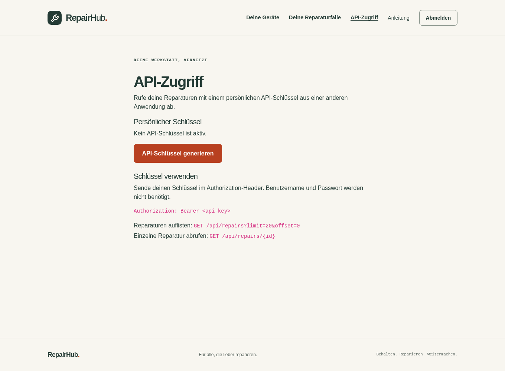

Klicke auf **API-Schlüssel generieren** und kopiere den angezeigten Schlüssel sofort
an einen geschützten Ort. Er wird nur einmal angezeigt. Im folgenden Screenshot
ist er absichtlich verdeckt.

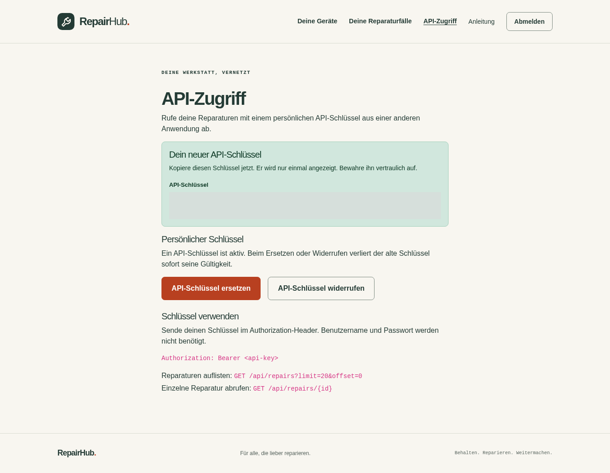

Bei einem späteren Besuch kannst du den Schlüssel **ersetzen** oder **widerrufen**.
Beide Aktionen machen den bisherigen Schlüssel sofort ungültig. Nach dem Ersetzen
musst du den neuen Schlüssel auch im verwendeten Client hinterlegen.

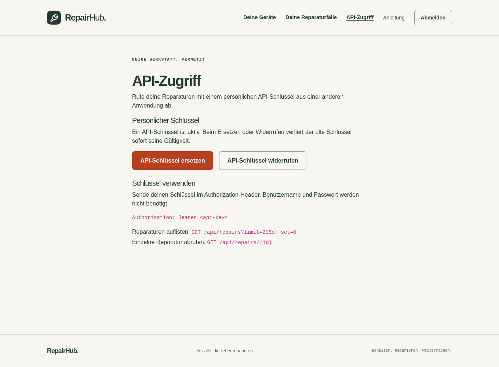

### Daten mit einem API-Client abrufen

Wähle beispielsweise in Postman die Methode **GET** und die URL
`https://lab19.ifalabs.org/api/repairs?limit=20&offset=0`. Lege diesen Header an;
ersetze den Platzhalter durch deinen persönlichen Schlüssel:

```http
Authorization: Bearer <dein-api-schluessel>
```

Die Antwort enthält `items`, `total` und Informationen zur nächsten Seite.
Übernimm eine `id` aus `items` für die Detailanfrage:

```http
GET https://lab19.ifalabs.org/api/repairs/123
Authorization: Bearer <dein-api-schluessel>
```

`123` ist nur ein Beispiel. Verwende die ID eines eigenen vorhandenen Falls.
Ein Benutzername oder Passwort wird nicht zusätzlich übermittelt.

| Antwort | Was du tun kannst |
| --- | --- |
| 200 | Daten erfolgreich gelesen; eine leere Liste bedeutet, dass keine eigenen Fälle vorliegen. |
| 400 | Parameter prüfen, beispielsweise `limit` und `offset`. |
| 401 | Header, Schlüssel und dessen Gültigkeit prüfen. |
| 404 | Fall-ID prüfen; fremde Fälle sind ebenfalls nicht zugänglich. |
| 405 | GET verwenden; die Reparatur-API erlaubt keine Schreiboperationen. |

Weitere Parameter, Curl-Beispiele und das vollständige Antwortformat stehen in der
[API-Dokumentation](../api.md). Den administrativen Systemschlüssel brauchst du
für die normale Nutzung nicht.

## 12. Sprache, Mobilgeräte und Hilfe

RepairHub berücksichtigt die bevorzugten Sprachen deines Browsers. Stelle Deutsch
vor Englisch ein und lade die Seite neu, wenn du die deutsche Oberfläche möchtest.
Ohne passende Sprachangabe verwendet RepairHub Englisch. Es gibt keinen separaten
Sprachumschalter; URLs bleiben auf Englisch.

Auf schmalen Bildschirmen stehen die Formularbereiche untereinander. Scrolle nach
unten zu Schritten, Kosten, Teilen und Bildern.

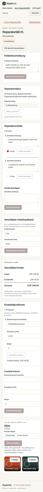

Ohne JavaScript funktionieren die grundlegenden Formulare weiterhin mit normalem
Seitenwechsel. Listen zeigen dann Seitenlinks, Suchformulare einen Anwenden-Button.
Warte nach jedem Speichern auf die Rückmeldung.

| Problem | Nächster Schritt |
| --- | --- |
| Button deaktiviert | Pflichtfelder, E-Mail-Format und Passwortwiederholung prüfen; beim Bearbeiten zuerst einen Wert ändern. |
| Fehlermeldung an einem Feld | Angabe korrigieren und den zugehörigen Speicherbutton erneut wählen. |
| Verbindung unterbrochen | Netzwerk prüfen und erneut versuchen; Erfolg erst nach Bestätigung annehmen. |
| Sitzung abgelaufen | Noch nicht gespeicherte Angaben separat sichern und erneut anmelden. |
| Unbekannte oder nicht zugängliche Seite | Über Navigation oder Rücklink zur Übersicht wechseln. |
| Bild abgelehnt | Format, Dateigrösse, Pixelanzahl und tatsächlichen Dateiinhalt prüfen. |

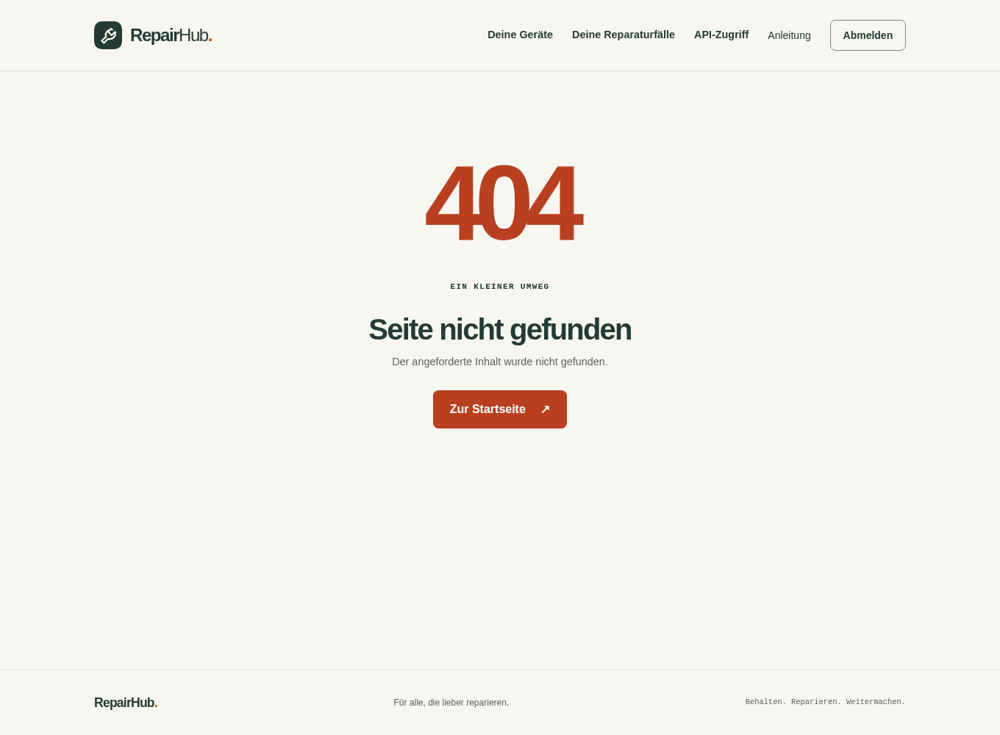

## Herkunft der Aufnahmen

Die Screenshots stammen aus dem reproduzierbaren
[Playwright-Ablauf](../../scripts/documentation/capture_user_guide.py).
Er verwendet isolierte Produktionsimages mit PostgreSQL, Garage und einem lokalen
Mailfänger. Die aufgezeichneten Beispielaktionen verändern keine Produktionsdaten.
Die schematischen Bilder im Mosaik sind eigens erzeugte Testgrafiken.
Quellstand und erfolgreich erstellte Aufnahmen stehen in [capture.json](capture.json).
Die fachliche Gesamtabnahme ist separat im [T12-Protokoll](../acceptance-test-protocol.md)
festgehalten.
